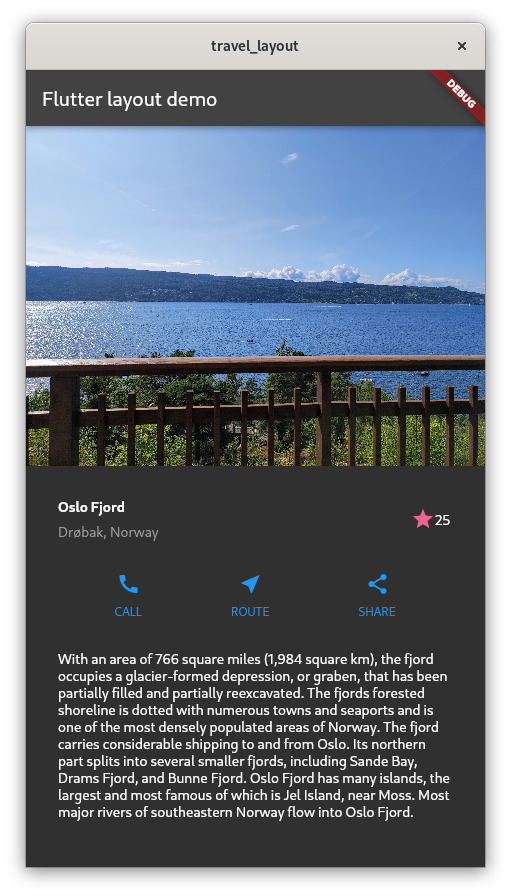

# Travel Layout

A Flutter demo app displaying a layout with an image, text sections and buttons to demonstrate core layout concepts.



## Technical Details

- Built with Flutter/Dart
- Uses Column and nested Row/Column widgets for layout
- Loads asset image and displays with Fit.cover
- Shows title, text and button sections
- Favorite button widget manages state
- Stateful widget handles favorite button

## Usage

To run the demo:
```
flutter run
```


